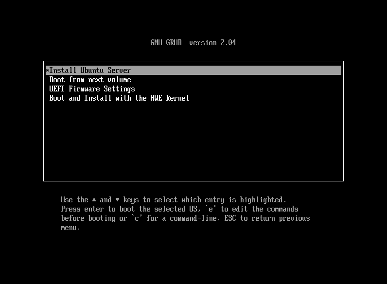
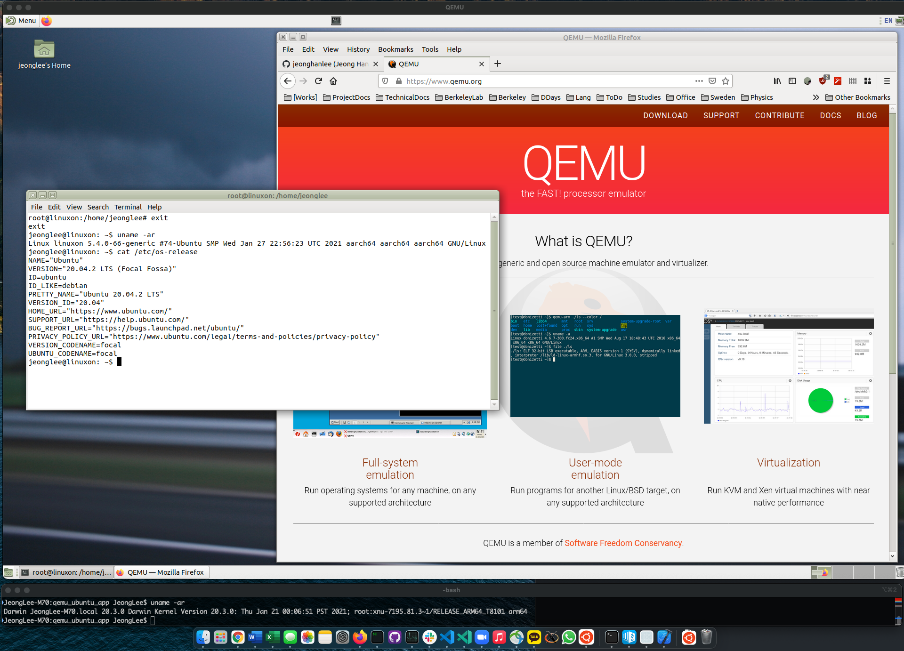

# Ubuntu 20.04, QEMU on Apple Silicon Mac


## QEMU / Ubuntu Setup for Apple M1

The original reference is at <https://gist.github.com/niw/e4313b9c14e968764a52375da41b4278#enable-the-internet>.
Please check it for further descriptions. The following procedure is tuned for me. 

```bash
$ sudo port install ninja pkgconfig glib2 pixman wget

$ pwd
/Users/JeongLee/github/qemu_ubuntu_app

$ git clone https://git.qemu.org/git/qemu.git qemu-src

$ cd qemu-src
$ git checkout d0dddab40e -b wip/hvf
$ curl 'https://patchwork.kernel.org/series/418581/mbox/'|git am --3way

$ mkdir build
$ cd build
$ ../configure --target-list=aarch64-softmmu --enable-cocoa
$ make -j

$ ./qemu-img create -f qcow2 ../../drive/ubuntu.qcow2 40G 

$ cd ../../drive
$ wget -c https://gist.github.com/niw/4f1f9bb572f40d406866f23b3127919b/raw/f546faea68f4149c06cca88fa67ace07a3758268/QEMU_EFI-cb438b9-edk2-stable202011-with-extra-resolutions.tar.gz
$ tar xzvf QEMU_EFI-*.tar.gz
$ dd if=/dev/zero of=pflash0.img bs=1m count=64
$ dd if=/dev/zero of=pflash1.img bs=1m count=64
$ dd if=QEMU_EFI.fd of=pflash0.img conv=notrunc
$ dd if=QEMU_VARS.fd of=pflash1.img conv=notrunc
$ wget -c https://cdimage.ubuntu.com/releases/20.04/release/ubuntu-20.04.2-live-server-arm64.iso
$ cd ..
$ sh install_ubuntu.sh
```


||
| :---: |
|**Figure 1** Ubuntu Boot Screenshot|


## Setup the compiled QEMU into the local folder for the next step

```bash
$ mkdir qemu
$ cp -r qemu-src/build/* qemu/
$ sh Contents/MacOS/main.command
```

## Build Apple Aplications, and deploy into `/Applications`.


```bash
$ pwd
/Users/JeongLee/github/qemu_ubuntu_app

$ rm -f drive/*.gz
$ rm -f drive/*.fd
$ rm -f drive/*.iso
$ sudo mkdir /Applications/QEMU_Ubuntu.app
$ sudo ditto Contents/ /Applications/QEMU_Ubuntu.app/Contents
$ sudo ditto qemu /Applications/QEMU_Ubuntu.app/qemu
$ sudo ditto drive/ /Applications/QEMU_Ubuntu.app/drive
```
 

||
| :---: |
|**Figure 2** Running Ubuntu through QEMU on Apple M1 screenshot|

 
 
Enjoy!

